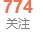
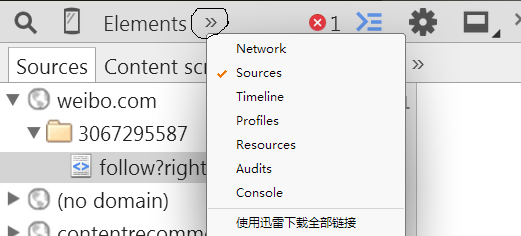
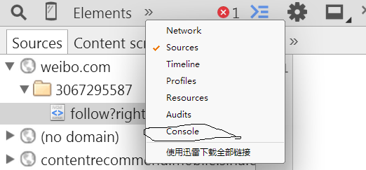
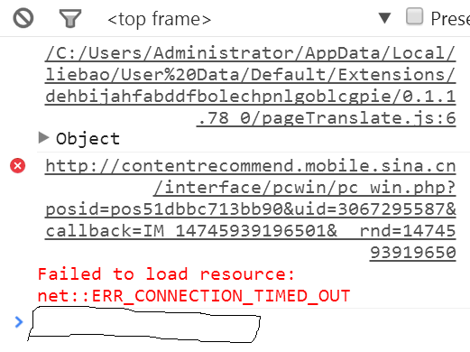

# CancelWeiboFocus
**自动取关所有微博关注的人**

功能是每隔3分钟自动取关30个已关注的人。

为什么要每隔3分钟？太过频繁会触发微博的反脚本机制，弹出验证码。

**使用方法**：

1. 下一个chrome内核的浏览器，如chrome 、猎豹浏览器。（当然用其他浏览器也行，只要你会打开控制台，chrome内核浏览器方便演示）

2. 打开浏览器，然后登录微博，进入主页，点击自己关注数。

   

3. 等网页加载完成后，按F12键唤出开发人员工具，并单击图中的字符

   

4. 选中图中的console,进入控制台

   

5. 然后点击图中位置，在其中粘贴"取关.txt"文档中的代码，按回车执行代码即可。

   

   ​

